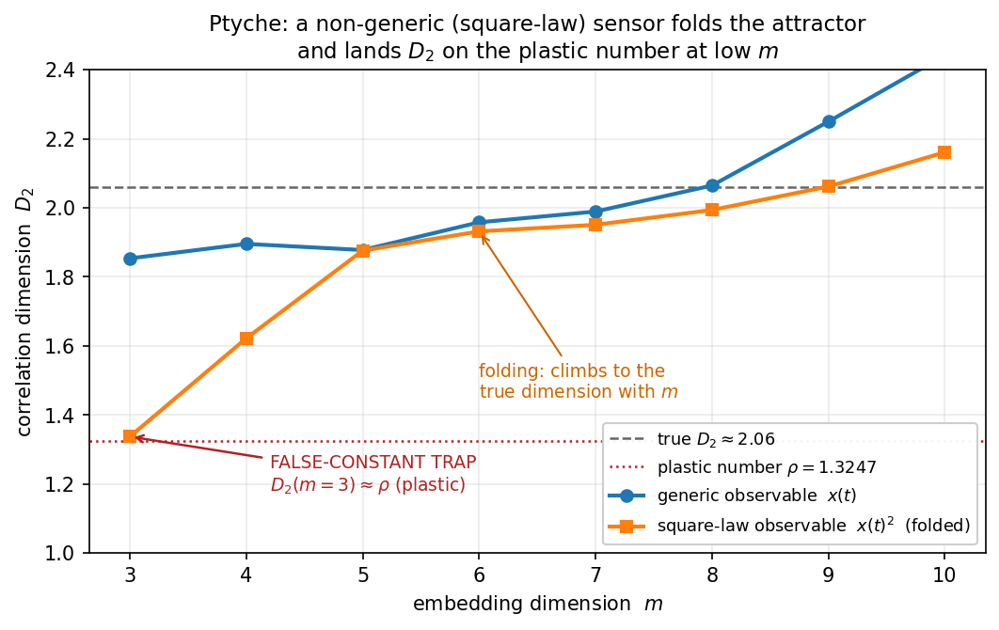

# Ptyche

**Trustworthy nonlinear-dynamics invariants from real (non-generic) sensor data.**

*Ptyche* (Greek πτυχή, "a fold") detects the attractor **folding** that corrupts chaos
invariants when a sensor records a non-generic observable, and recovers the true values.

```bash
pip install ptyche
```

## The bottleneck it breaks

Most sensors don't record a system's state — they record a *nonlinear function* of it:
intensity (∝ amplitude²), power, magnitude `|x|`, rectified or log signals. Takens' embedding
theorem only guarantees attractor reconstruction for **generic** observables. An even/symmetric
observable of a (near-)symmetric system — the usual case for intensity/power — is **non-generic**:
the delay embedding reconstructs only the *symmetry quotient* of the attractor. Standard
pipelines then pick an embedding dimension `m` by hand and report a correlation dimension `D2`,
Lyapunov exponent `λ₁`, or entropy `K2` that is **silently wrong** (folded, under-resolved) — and
sometimes lands on a famous constant, producing a false "discovery."

Ptyche breaks this **reliability bottleneck** (it is not magic and breaks no law of computation)
with the same three-step machinery applied to every invariant:

1. **Converge** — estimate the invariant across embedding dimensions and report the **plateau /
   most-converged value**, not a single hand-picked `m` (GP estimates inflate at large `m`; the
   low-`m` value under-resolves).
2. **Detect folding** — flag genericity failure (`D2` rises sharply from low `m` to the plateau)
   and recover the true dimension.
3. **Guard against false constants** — warn when an *unconverged* estimate sits on an **exotic**
   number (golden ratio, plastic number, √2, e, π, Feigenbaum δ, …). Integers and simple
   fractions are deliberately excluded — a limit cycle's `D2 = 1` is real, not a trap.

## Three invariants, one wrapper

| function | invariant | method |
|---|---|---|
| `correlation_dimension` / `analyze` | `D2` | Grassberger–Procaccia, plateau-converged |
| `lyapunov_rosenstein` | `λ₁` | Rosenstein mean-log-divergence (+ `r²` fit quality) |
| `k2_entropy` | `K2` | GP correlation entropy, convergence-aware (KS lower bound) |

## The folding curve



`D2` vs embedding dimension `m` for the *same* Lorenz attractor seen two ways. The square-law
(intensity) observable is **folded**: at `m = 3` it lands right on the plastic number `ρ = 1.3247`
(the trap) and only climbs to the true `D2 ≈ 2.06` as `m` grows. The generic observable stays
near the truth — and both curves *inflate* past `m ≈ 8`, which is exactly why Ptyche reports the
**plateau** rather than `max(m)`. Regenerate with `python examples/figure_folding.py`.

## Worked example (`python demo.py`)

A square-law (intensity) detector watching the Lorenz attractor (true `D2 ≈ 2.06`,
`λ₁ ≈ 0.906/t`):

```
--- square-law observable  x(t)^2   (intensity/power sensor) ---
  D2 by embedding m: {3: 1.306, 4: 1.615, 5: 1.881, 6: 1.937, 7: 1.964, 8: 1.998}
  naive D2 (low m) = 1.306 | converged/best D2 = 1.998
  verdict: FOLDED (use converged D2, distrust the naive value)
  * FALSE-CONSTANT TRAP: low-m D2=1.306 ~ plastic number rho (1.3247) -- a resolution
    artifact, NOT a coincidence; the converged D2 = 2.00.
```

The naive pipeline would have reported `D2 ≈ 1.33` (the plastic ratio!). Ptyche flags the
folding, recovers `D2 ≈ 2`, and names the trap. On the *generic* observable it returns the
trustworthy `D2 ≈ 2.06`, `λ₁ ≈ 0.91/t`.

## Use

```python
import numpy as np, ptyche as p

rep = p.analyze(signal, fs=1/dt)     # fs = sampling rate -> rates in per-time units
print(rep.verdict, rep.D2_converged, rep.folded, rep.false_constant_traps)
print(rep.lyapunov1["lambda1"], rep.k2_entropy["K2"])
for note in rep.notes:               # plain-language caveats (folding, fit quality, convergence)
    print(note)
```

Individual estimators: `p.lyapunov_rosenstein(x, fs=...)`, `p.k2_entropy(x, fs=...)`,
`p.embedding_scan`, `p.converged_dimension`, `p.folding_score`, `p.false_constant_warnings`,
and `p.logperiodic_squarelaw_check` (for discrete-scale-invariant signals: a square-law detector
measures the apparent rescaling ratio as √λ, not λ).

## Honest scope

Ptyche makes existing scalar-series estimators **harder to fool**; it does not beat dedicated
multi-channel Lyapunov packages on precision. `D2` and `λ₁` are essentially exact on Lorenz;
`K2` from a single scalar series converges slowly and is reported **with** its convergence flag
(treat a non-converged `K2` as an upper estimate). Slow-`λ` systems (e.g. Rössler) may need a
wider `fit_window` — the `r²` field tells you when the fit is poor.

## Provenance

Derived from the *Systrophē* chronology-protection study, where a gravitational-wave
cross-polarization `ψ ∝ ω²` (an even observable of the Z₂-symmetric Lorenz attractor)
under-reconstructed the attractor, and a `D2 ≈ 1.30 ≈` plastic-number coincidence turned out to
be a low-embedding artifact. Ptyche packages that lesson as a general guard.

Dependencies: `numpy`, `scipy`. License: MIT.
